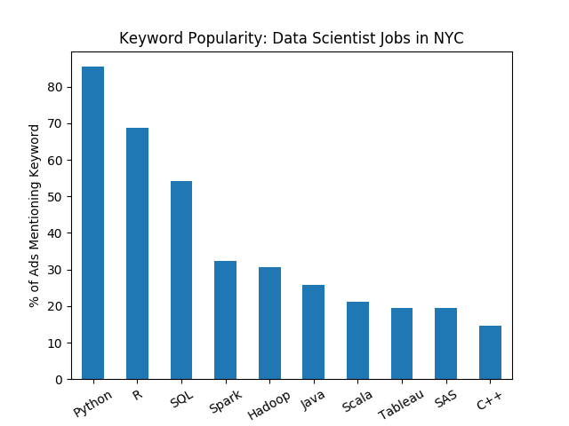

# Web Scraping Monster.com for In-Demand Data Science Skills

## Motivation

I came across [this nice blog post](https://jessesw.com/Data-Science-Skills/) by Jesse Steinweg-Woods about how to scrape [Indeed.com](https://www.indeed.com) for key skills that employers are looking for in data scientists. Jesse showed the graphic below by [Swami Chandrasekaran](http://nirvacana.com/thoughts/becoming-a-data-scientist/) to demonstrate the point that it would take a lifetime (or more) to master all the tools required to qualify for every job listing.


Rather than learn everything, we should learn the tools that have the greatest probability of ending up on the "requirements" list of a job posting. We can go to a website like Indeed and collect the keywords commonly used in data science postings. Then we can plot the keyword versus its frequency, as a function of the city in which one would like to work. 

Jesse developed some nice code in Python to:
* Construct a URL to the search results for job postings matching a given city and state (or nationwide, if none are specified)
* Extract and tally keywords from data science job postings listed in the search results

Below were the results for NYC back in 2015, when he wrote this code (credit to Jesse for the graphic).


---

I decided to apply a similar analysis to [Monster.com](https://www.monster.com/), another job listings board. I was 
curious as to how similar the results were to Indeed. Of course, it's been four years since Jesse's original analysis, 
so there more variables in play than the change in platform.

## Installation

To install the requirements for `phyre`, use

```bash
pip install -r requirements.txt
```

I recommend creating a virtual environment so that the proper versions of each package are installed without any conflicts.

**Note**: The `MonsterTextParser` class depends on a language processing toolkit called `nltk`. After `nltk` is installed, you must take the following steps in a Python console:

```python
import nltk
nltk.download('stopwords')
```

Then everything should work.

Also, keep `monster.py` in the same directory as your scripts so you can import its modules.

## Walkthrough

Take a look at the [Jupyter notebook](https://nbviewer.jupyter.org/github/benmayersohn/monster-scraping/blob/master/MonsterScraping.ipynb), which walks through the logic and shows some examples of how to use the classes in `monster.py` to construct queries, store/load search results, and count keywords in the returned results. You can also look at the examples in the root directory (`datasci_keyword_counts.py` anything that ends with `_tests.py` ).

## Results

Below are the results I obtained from a search for "Data Scientist" jobs in "New York, NY". There are 179 listings in total.



It seems that just like in 2015, Python, R, and SQL reign supreme, but Python has surpassed R in popularity.

## Directory Structure

Below is a breakdown of the files in this repository.
<pre class="language-bash"><code class="language-bash">monster-scraping
|____assets            
| |____data_sci_nyc_results.png         # bar plot of most popular Data Scientist jobs in NYC from Monster
| |____proj6_nb_22_1.png                # bar plot by Jesse showing most popular tools from scraping Indeed.com in 2015
| |____RoadToDataScientist1.png         # Graphic by Swami Chandrasekaran showing tools need to master data science
| |____wework_application.png           # Screenshot of a job posting by WeWork from Monster.com
| |____screenshot.png                   # Screenshot of list of search results from Monster.com
|____data          
| |____data_scientist_nyc_search.json   # results from searches for Data Scientist jobs in NYC
| |____wework_description.txt           # job description scraped from a posting by WeWork on Monster.com
|____datasci_keyword_counts.py          # Loads data_scientist_nyc_search.json, counts keywords, and plots frequencies
|____requirements.txt                   # Required libraries for running the scripts in main directory
|____search_tests.py                    # Tests to ensure the MonsterSearch class works
|____location_listing_tests.py          # Tests to ensure the MonsterListing and MonsterLocation classes work
|____counting_tests.py                  # Finds the keyword frequencies for a single data scientist job posting
|____README.md                          # this
|____monster.py                         # The main module we've created to organize searches and listings.
|____helpers.py                         # Contains a few constants we use, including list of data science keywords
|____wework_details.txt                 # Details about posting whose description is in wework_description.txt
|____MonsterScraping.ipynb              # Jupyter notebook explaining how I went about scraping Monster.com
</code></pre>


